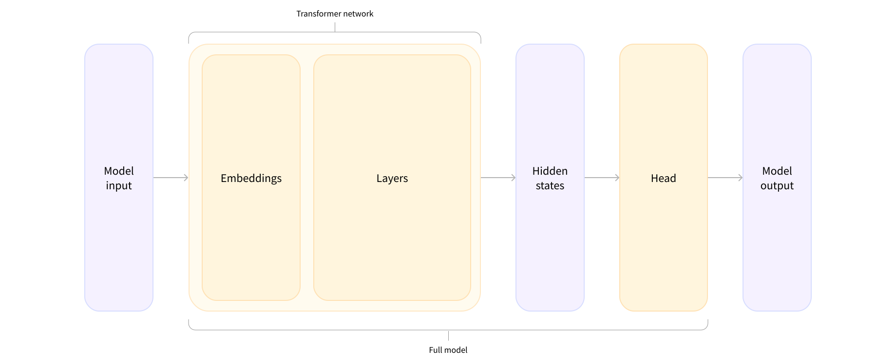

# NLPJourney


This repository is a collection of notes, code snippets, and resources for learning Natural Language Processing (NLP) I collected throughout my journey. The main goal is to have a reference guide for future projects and to share knowledge with others.

# Index

- [Project Overview](#project-overview)
- [What is NLP?](#what-is-nlp)
- [Learnings](#learnings)
  - [Model heads: Making sense out of numbers](#model-heads-making-sense-out-of-numbers)
  - [Callbacks](#callbacks)
  - [Huggin Face storing](#huggin-face-storing)
  - [Tokenizers Algorithms](#tokenizers-algorithms)
- [Toolbox](#toolbox)
    - [Pipeline](#pipeline)
    - [Easy Baseline & Labeling](#easy-baseline--labeling)
    - [The Hugging Face Hub: Models](#the-hugging-face-hub-models)
    - [Sharing a Model at Hugging Face](#sharing-a-model-at-hugging-face)
    - [Accelerate](#accelerate)
    - [Dataset map() batched](#dataset-map-batched)
    - [Custom Data Collator](#custom-data-collator)
    - [Environment Impact](#environment-impact)
    - [Training Tricks](#training-tricks)
      - [Memory Efficient Training](#memory-efficient-training)
    - [Chat Training](#chat-training)
      - [Chat Training Template](#chat-training-template)
      - [Chat Inference Template](#chat-inference-template)
    - [Tools Table](#tools-table)
- [Useful Links](#useful-links)
- [To-Do](#to-do)
  - [Main NLP Tasks](#main-nlp-tasks)
  - [Advanced NLP Tasks](#advanced-nlp-tasks)
  - [Mini Projects](#mini-projects)
  - [Other](#other)
- [Credits](#credits)
  - [Courses](#courses)
  - [Posts & Articles](#posts--articles)


# Project Overview

```
├── basics       <- Hugging Face basic concepts and examples
│   ├── hf_pipeline               <- NLP pipelines examples
│   ├── hf_inference              <- Breakdown pipeline components
│   ├── hf_model_creation         <- Instantiate models
|   ├── hf_tokenizers             <- Tokenizers basics
│   ├── hf_processing_data        <- Loading dataset from Hub
│   ├── hf_finetuning             <- Basic fine-tuning task
│   ├── hf_datasets               <- Dataset operations
│   ├── hf_tokenizers_training    <- Adapt tokenizers to new data
│   └── hf_tokenizers_offsets     <- Tokenizers offset mapping
|
├──  mains_tasks  <- Tackling main NLP tasks
|   ├── sequence_classification   <- Classify sequences of tokens
|   ├── token_classification      <- Set labels for each token
|   ├── masked_language_modeling  <- Filling blanks for domain adaptation
|   ├── causal_language_modeling  <- Predict next token
|   └── semantic_search           <- Retrieve similar documents
|
└── sft           <- Supervised Fine-Tuning
    ├── chat_templates            <- Chat templates
    ├── sfttrainer                <- Model training for completions
    └── lora                      <- LoRA fine-tuning
```

*Only the most important files and directories are listed above.*


# What is NLP?
NLP is a field of linguistics and machine learning focused on understanding everything related to human language. The aim of NLP tasks is not only to understand single words individually, but to be able to understand the context of those words.

The following is a list of common NLP tasks, with some examples of each:

- **Classifying whole sentences**: Getting the sentiment of a review, detecting if an email is spam, determining if a sentence is grammatically correct or whether two sentences are logically related or not
- **Classifying each word in a sentence**: Identifying the grammatical components of a sentence (noun, verb, adjective), or the named entities (person, location, organization)
- **Generating text content**: Completing a prompt with auto-generated text, filling in the blanks in a text with masked words
- **Extracting an answer from a text**: Given a question and a context, extracting the answer to the question based on the information provided in the context
- **Generating a new sentence from an input text**: Translating a text into another language, summarizing a text

NLP isn’t limited to written text though. It also tackles complex challenges in speech recognition and computer vision, such as generating a transcript of an audio sample or a description of an image.


# Learnings

## Model heads: Making sense out of numbers

`AutoModel` architecture contains only the base Transformer module: given some inputs, it outputs what we’ll call `hidden states`, also known as `features`. For each model input, we’ll retrieve a high-dimensional vector representing the contextual understanding of that input by the Transformer model.

```python
from transformers import AutoModel

checkpoint = "distilbert-base-uncased-finetuned-sst-2-english"
model = AutoModel.from_pretrained(checkpoint)
outputs = model(**inputs)
# outputs.last_hidden_state (batch_size, sequence_length, hidden_size)
```


The model heads take the high-dimensional vector of hidden states as input and project them onto a different dimension.



There are many different architectures available in Hugging Face Transformers, with each one designed around tackling a specific task. Here is a non-exhaustive list:

- `*Model` (retrieve the hidden states)
- `*ForCausalLM`
- `*ForMaskedLM`
- `*ForMultipleChoice`
- `*ForQuestionAnswering`
- `*ForSequenceClassification`
- `*ForTokenClassification`
- and others

If, for example, we need a model with a sequence classification head, to be able to classify the sentences as positive or negative, we won’t actually use the AutoModel class, but AutoModelForSequenceClassification.

```python
from transformers import AutoModel

checkpoint = "distilbert-base-uncased-finetuned-sst-2-english"
model = AutoModelForSequenceClassification.from_pretrained(checkpoint)
outputs = model(**inputs)
# outputs.logits (batch_size, num_labels)
```

## Callbacks

Callbacks are a way to customize the training loop of the Trainer. They are functions that are called at different points during training, and can be used to modify the behavior of the Trainer. For example, we can use a callback to log the training loss at the end of each epoch, or to save the model to disk every few steps. Some important Callbacks are:

- [`EarlyStoppingCallback`](https://huggingface.co/docs/transformers/en/main_classes/callback#transformers.EarlyStoppingCallback): Stops training when a metric has stopped improving.
- [`Custom Callbacks`](https://huggingface.co/docs/transformers/en/main_classes/callback#transformers.TrainerCallback): Create your own callbacks by subclassing `TrainerCallback`.

## Huggin Face storing

### Models

When using `from_pretrained()`, the weights are downloaded and cached (so future calls to the  method won’t re-download them) in the cache folder, which defaults to `~/.cache/huggingface/transformers`. We can customize your cache folder by setting the `HF_HOME` environment variable.

### Data

When using `datasets.load_dataset()`, the datasets are downloaded and cached in the cache folder, which defaults to `~/.cache/huggingface/datasets`. We can customize your cache folder by setting the `HF_HOME` environment variable.

## Tokenizers Algorithms

| Model         | BPE                                                                          | WordPiece                                                                                                                                                          | Unigram                                                                                           |
|---------------|------------------------------------------------------------------------------|--------------------------------------------------------------------------------------------------------------------------------------------------------------------|---------------------------------------------------------------------------------------------------|
| Training      | Starts from a small vocabulary and learns rules to merge tokens              | Starts from a small vocabulary and learns rules to merge tokens                                                                                                    | Starts from a large vocabulary and learns rules to remove tokens                                  |
| Training step | Merges the tokens corresponding to the most common pair                      | Merges the tokens corresponding to the pair with the best score based on the frequency of the pair, privileging pairs where each individual token is less frequent | Removes all the tokens in the vocabulary that will minimize the loss computed on the whole corpus |
| Learns        | Merge rules and a vocabulary                                                 | Just a vocabulary                                                                                                                                                  | A vocabulary with a score for each token                                                          |
| Encoding      | Splits a word into characters and applies the merges learned during training | Finds the longest subword starting from the beginning that is in the vocabulary, then does the same for the rest of the word                                       | Finds the most likely split into tokens, using the scores learned during training                 |


# Toolbox

## Pipeline

Checkout `basics/hf_pipeline.ipynb` for examples of using Hugging Face's pipeline for NLP tasks. There are several tasks you can try out of the box without too much effort.

Check available pipelines [here](https://huggingface.co/docs/transformers/main_classes/pipelines)


## Easy Baseline & Labeling

For many NLP tasks, we can rely on pre-trained models that have been trained on large datasets. Leveraging zero-shot or few-shot capabilities of these models can provide a strong baseline for many tasks.

For example, for making a spam and mail classifier, we can just use a zero-shot classifier from Hugging Face Transformers library.

```python
from transformers import pipeline

oracle = pipeline(model="facebook/bart-large-mnli")
oracle(
    "I have a problem with my iphone that needs to be resolved asap!!",
    candidate_labels=["urgent", "not urgent", "phone", "tablet", "computer"],
)
"""
Output:
{
 'sequence': 'I have a problem with my iphone. Resolved asap!!',
 'labels': ['urgent', 'phone', 'not urgent', 'tablet', 'computer'],
 'scores': [0.504131, 0.479352, 0.013123621, 0.003235, 0.0022361]
}
"""
```

## The Hugging Face Hub: Models

The models in the Hub are not limited to Hugging Face Transformers or even NLP. There are models from [Flair](https://github.com/flairNLP/flair) and [AllenNLP](https://github.com/allenai/allennlp) for NLP, [Asteroid](https://github.com/asteroid-team/asteroid) and [pyannote](https://github.com/pyannote/pyannote-audio) for speech, and [timm](https://github.com/rwightman/pytorch-image-models) for vision, to name a few.


## Sharing a Model at Hugging Face

You can train you own model and share it at Hugging Face. You can find the instructions [here](https://huggingface.co/learn/nlp-course/chapter4/3?fw=pt#sharing-pretrained-models) and [here](https://huggingface.co/transformers/model_sharing.html). Also, information about building a model card [here](https://huggingface.co/learn/nlp-course/chapter4/4?fw=pt).


## Accelerate

We can easily [supercharge](https://huggingface.co/learn/nlp-course/chapter3/4?fw=pt#supercharge-your-training-loop-with-accelerate) our training loop with Hugging Face [Accelerate library](https://github.com/huggingface/accelerate). Checkout an example at `basics/hf_finetuning_pytorch_accelerate.ipynb`.

Then the main bulk of the work is done in the line that sends the dataloaders, the model, and the optimizer to `accelerator.prepare()`. This will wrap those objects in the proper container to make sure your distributed training works as intended. The remaining changes to make are removing the line that puts the batch on the device (again, if you want to keep this you can just change it to use `accelerator.device`) and replacing `loss.backward()` with `accelerator.backward(loss)`.

> In order to benefit from the speed-up offered by Cloud TPUs, we recommend padding your samples to a fixed length with the `padding="max_length"` and `max_length` arguments of the tokenizer.

Putting this in a train.py script will make that script runnable on any kind of distributed setup. To try it out in your distributed setup, run the command:

```bash
accelerate config
```

which will prompt you to answer a few questions and dump your answers in a configuration file used by this command:

```bash
accelerate launch train.py
```

which will launch the distributed training. You can find more examples in the Hugging Face [Accelerate repo](https://github.com/huggingface/accelerate/tree/main/examples).

## Dataset map() batched

Map method applies a custom processing function to each row in the dataset. **Should return a dictionary**. If the item has new columns/keys, they will be added to the dataset, if it has the same keys, it will be replaced. We can use the map method in batch mode with `Dataset.map(function, batched=True)`. For example:

```python
def lowercase_title(example):
    return {"title": example["title"].lower()}

my_dataset = my_dataset.map(lowercase_title)
```
The `Dataset.map()` method takes a batched argument that, if set to `True`, causes it to send a batch of examples to the map function at once (the batch size is configurable but defaults to 1,000). For instance, the previous map function that unescaped all the HTML took a bit of time to run (you can read the time taken from the progress bars). We can speed this up by **processing several elements at the same time** using a list comprehension.

When you specify `batched=True` the function receives a dictionary with the fields of the dataset, but **each value is now a list of values, and not just a single value**. The return value of `Dataset.map()` should be the same: a dictionary with the fields we want to update or add to our dataset, and a list of values. For example, here is another way to lowercase all titles, but using `batched=True`:

```python
def lowercase_title(batch):
    return {"title": [title.lower() for title in batch["title"]]}

my_dataset = my_dataset.map(lowercase_title, batched=True)
```

## Custom Data Collator

When using a model that requires a specific data collator, we can create a custom data collator. You can find an example in [this notebook](main_tasks/masked_language_modeling/hf_mlm_domain-adaptation.ipynb) about masked language modeling and whole word masking.

A data collator is just a function that takes a list of samples and converts them into a batch.

> By default, the Trainer will remove any columns that are not part of the model’s forward() method. This means that if, for example, you’re using the whole word masking collator, you’ll also need to set `remove_unused_columns=False` to ensure we don’t lose the word_ids column during training.


## Environment Impact

- [ML CO2 Impact]((https://mlco2.github.io/impact/)): Website to calculate the carbon footprint of your machine learning models. Is integrated with Hugging Face's model hub. To learn more about this, you can read this [blog post](https://huggingface.co/blog/carbon-emissions-on-the-hub) which will show you how to generate an `emissions.csv` file with an estimate of the footprint of your training, as well as the [documentation](https://huggingface.co/docs/hub/model-cards-co2) of Hugging Face Transformers addressing this topic.


## Training Tricks

### Memory Efficient Training

- **Gradient Accumulation**: Accumulate gradients over multiple steps before performing an optimization step. This is useful when the model is too large and you have to use a smaller batch size but still want to use a large effective batch size for stable training.
- **Gradient Checkpointing**: Trade compute for memory by recomputing the forward pass of the model during backpropagation. This is useful when the model is too large to fit in memory.
- **Mixed Precision Training**: Use half-precision floating point arithmetic to reduce memory usage and speed up training.
- **LoRA**: There are methods that focus on fine-tuning large models by adding *adapter layers* to the model during fine-tuning, which can reduce the memory footprint of the model. After fine-tuning, the adapter layers can be merged into the model, introducing no additional parameters nor computational overhead.
- **Quantization**: There are tools like Unsloth that provide quantized models for training and inference, which can be used to reduce the memory footprint of the model.
- **Freeze Layers**: Freeze the weights of some layers during training to reduce the memory footprint of the model.


## Chat Training

### Chat Training Template

[Daset format support](https://huggingface.co/docs/trl/sft_trainer#dataset-format-support). The `SFTTrainer` supports popular dataset formats. This allows you to pass the dataset to the trainer without any pre-processing directly. The following formats are supported:

- conversational format
```python
{"messages": [{"role": "system", "content": "You are helpful"}, {"role": "user", "content": "What's the capital of France?"}, {"role": "assistant", "content": "..."}]}
{"messages": [{"role": "system", "content": "You are helpful"}, {"role": "user", "content": "Who wrote 'Romeo and Juliet'?"}, {"role": "assistant", "content": "..."}]}
{"messages": [{"role": "system", "content": "You are helpful"}, {"role": "user", "content": "How far is the Moon from Earth?"}, {"role": "assistant", "content": "..."}]}
```

- instruction format
```python
{"prompt": "<prompt text>", "completion": "<ideal generated text>"}
{"prompt": "<prompt text>", "completion": "<ideal generated text>"}
{"prompt": "<prompt text>", "completion": "<ideal generated text>"}
```

If your dataset uses one of the above formats, you can **directly pass it to the trainer without pre-processing**. The SFTTrainer will then format the dataset for you using the defined format from the model’s tokenizer with the `apply_chat_template` method. Checkout the [example](sft/sfttrainer.ipynb) notebook.

### Chat Inference Template

At inference time, it is important to use the same format as the training data. The model and the tokenizer must be loaded with the same format as the training data. Once loaded, when we want to generate completions, we need to `apply_chat_template` to the input data with `add_generation_prompt` set to `True`. This will format the input data in the same format as the training data.

```python
messages = [
    {"role": "user", "content": "Continue the sequence: 1, 1, 2, 3, 5, 8,"},
]
inputs = tokenizer.apply_chat_template(
    messages,
    tokenize = True,
    add_generation_prompt = True, # Must add for generation
    return_tensors = "pt",
).to("cuda")
```

Note that we must add the same system message (if we used it during training) to the input data. You can also verify the format with `tokenize` set to `True` and `False` to same inputs for training and inference.


## Tools Table

| Tool  | Description                                                                                                                                    | Tags                 |
|-------|------------------------------------------------------------------------------------------------------------------------------------------------|----------------------|
| [vLLM](https://docs.vllm.ai/en/latest/)  | vLLM is a fast and easy-to-use library for LLM inference and serving.                                                                          | LLM - Serving        |
| [LoRAX](https://loraexchange.ai/) | Serve thousands of fine-tuned models on a single GPU, dramatically reducing the cost of serving without compromising on throughput or latency. | LLM - LoRA - Serving |
| [LLM Compressor](https://github.com/vllm-project/llm-compressor)  | Easy-to-use library for optimizing models for deployment with vllm  |  LLM - Compression   |
| [Ludwig](https://github.com/ludwig-ai/ludwig)  |  Ludwig is a low-code framework for building custom AI models like LLMs and other deep neural networks.  | LLM - Fine-Tuning - Low-Code  |
| [Axolotl](https://github.com/axolotl-ai-cloud/axolotl)  |  Axolotl is a tool designed to streamline the fine-tuning of various AI models, offering support for multiple configurations and architectures. | LLM - Fine-Tuning - Low-Code  |
| [LitGPT](https://github.com/Lightning-AI/litgpt)  |  High-performance LLMs with recipes to pretrain, finetune, deploy at scale  | LLM - Fine-Tuning - Low-Code  |
|  [Distilabel](https://distilabel.argilla.io/latest/)  | Synthesize data for AI and add feedback on the fly!  | Data - Synthetic |


# Useful Links

- [Dataset loading documentation](https://huggingface.co/docs/datasets/loading): Guide to learn how to load a dataset from: The Hub without a dataset loading script; Local loading script; Local files; In-memory data; Offline; A specific slice of a split. Audio, Image and Text datasets.


# To-Do

## Main NLP Tasks

- [ ] [Sequence Classification](main_tasks/sequence_classification)
  - [x] BERT
  - [ ] TF-IDF
- [x] [Named Entity Recognition (Token Classification)](main_tasks/token_classification)
- [x] [Fine-tuning a masked language model](main_tasks/masked_language_modeling)
- [ ] Translation
- [ ] Summarization
- [ ] Question Answering
- [x] [Causal Language Modeling](main_tasks/causal_language_modeling)
- [x] [Semantic Search](main_tasks/semantic_search)
- [ ] Retrieval Augmented Generation (RAG)


## Advanced NLP Tasks

- [ ] Visual Document Understanding - Parsing: [Donut Tutorial](https://www.philschmid.de/fine-tuning-donut)
- [ ] Review [Unstloth Documentation](https://docs.unsloth.ai/) and Projects
  - [ ] [Chat Templates](https://docs.unsloth.ai/basics/chat-templates)
  - [ ] [Reward Modeling](https://docs.unsloth.ai/basics/reward-modelling-dpo-and-orpo)
  - [ ] & More - Create a folder with examples and projects
- [ ] [Instruction-Following SFT](https://wandb.ai/capecape/alpaca_ft/reports/How-to-Fine-Tune-an-LLM-Part-1-Preparing-a-Dataset-for-Instruction-Tuning--Vmlldzo1NTcxNzE2). [Hermes 3](https://nousresearch.com/hermes3/) proposes [Completions Only](https://huggingface.co/docs/trl/sft_trainer#train-on-completions-only) cross-entropy loss
  - [ ] Completions Only
- [ ] DPO
- [ ] ORPO

## Mini Projects

- [ ] Improved sequence classification: Compare the performance of a base model finetuned on IMDB with a model previously finetuned with MLM on the same dataset and later finetuned on IMDB for sequence classification.


## Other


- [ ] [Large Language Model Course - Maxime Labonne](https://github.com/mlabonne/llm-course)
- [ ] [Book | LLM Engineer's Handbook - Maxime Labonne](https://www.amazon.com/dp/1836200072?ref=cm_sw_r_cp_ud_dp_ZFR4XZPT7EY41ZE1M5X9&ref_=cm_sw_r_cp_ud_dp_ZFR4XZPT7EY41ZE1M5X9&social_share=cm_sw_r_cp_ud_dp_ZFR4XZPT7EY41ZE1M5X9)
- [ ] [Book | Building LLMs for Production - Louis-François Bouchard](https://www.amazon.com/Building-LLMs-Production-Reliability-Fine-Tuning/dp/B0D4FFPFW8)
- [ ] [Fine-tune Llama 3.1 Ultra-Efficiently with Unsloth](https://mlabonne.github.io/blog/posts/2024-07-29_Finetune_Llama31.html): A comprehensive overview of supervised fine-tuning.


# Credits
## Courses

- [Hugging Face NLP Course](https://huggingface.co/learn/nlp-course)

## Posts & Articles

- [Unsloth](https://github.com/unslothai/unsloth): UnslothAI is a parameter-efficient fine-tuning library for LLMs that accelerates fine-tuning by 2-5 times while using 70% less memory.
- [RAG using Llama 3 by Meta AI - Lightning AI](https://lightning.ai/lightning-ai/studios/rag-using-llama-3-1-by-meta-ai?query=llama+3.1): A studio building a completely self-hosted "Chat with your Docs" RAG application using Llama-3, served locally through Ollama.
- [Create synthetic datasets with Llama 3.1 - Lightning AI](https://lightning.ai/lightning-ai/studios/create-synthetic-datasets-with-llama-3-1?query=llama+3.1): Laverage Llama 3.1 models and [Distilabel](https://distilabel.argilla.io/latest/), an open-source framework for AI engineers, to create and evaluate synthetic data.
- [Finetune and Deploy Llama 3.1 8B - Lightning AI](https://lightning.ai/lightning-ai/studios/finetuning-and-serving-llama-3-1-8b): A studio that shows how to finetune and deploy a Llama 3.1 8B model using [LitGPT](https://github.com/Lightning-AI/litgpt).
- [Prompt Engineering vs Finetuning vs RAG](https://myscale.com/blog/prompt-engineering-vs-finetuning-vs-rag/): Pros and cons of each technique. This is important because it will help you to understand when and how to use these techniques effectively.
- [Safeguarding LLMs with Guardrails](https://towardsdatascience.com/safeguarding-llms-with-guardrails-4f5d9f57cff2): Given that the open-ended nature of LLM-driven applications can produce responses that may not align with an organization’s guidelines or policies, a set of safety measurements and actions are becoming table stakes for maintaining trust in generative AI.
- [The Ultimate Guide to LLM Fine Tuning: Best Practices & Tools](https://www.lakera.ai/blog/llm-fine-tuning-guide): Explore various Large Language Models fine tuning methods and learn about their benefits and limitations.
- [Evaluating Large Language Models: Methods, Best Practices & Tools](https://www.lakera.ai/blog/large-language-model-evaluation): Explore 7 effective methods, best practices, and evolving frameworks for assessing LLMs' performance and impact across industries.

