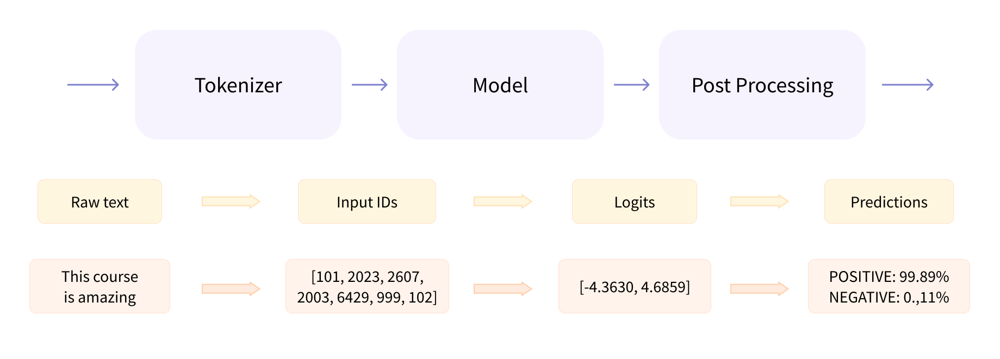

# Basics

Here you can find some basic work related to NLP.

## HF Pipeline

Checkout [hf_pipeline.ipynb](hf_pipeline.ipynb) for examples of using Hugging Face's pipeline for NLP tasks. There are several tasks you can try out of the box without too much effort.

Check available pipelines [here](https://huggingface.co/docs/transformers/main_classes/pipelines)


## HF Inference: Behind the pipeline

At this Notebook we [break down](https://huggingface.co/learn/nlp-course/chapter2/2?fw=pt) the Hugging Face pipeline into its components and show how to use them separately. This is useful when you want to have more control over the process:
- Preprocessing
- Model
- Postprocessing




## HF Model Creation

The `AutoModel` API allows us to instantiate a pretrained model from any checkpoint. The `AutoConfig` API allows us yo instantiate the configuration of a pretrained model from any checkpoint. The configuration contains all the information needed to load the model.

With the configuration, we can instantiate a given model with random weights from the configuration, or even modify the configuration before instantiating the model to adapt it to our needs. o do so we will use keyword arguments, and later on we will be able to train the model from scratch.


## HF Tokenizers

How to encode, decode, and use tokenizers in Hugging Face. We will also see how to use the tokenizer to preprocess the data before feeding it to the model.

We will see which is the role of `padding` the inputs, the `attention masks`, the `token_type_ids`, and how to do it with the tokenizer.

Finally, we will wrap everything by just using the `tokenizer` object to preprocess the data and feed it to the model. This allows us to set the padding, truncation, and return tensors directly from the tokenizer, as well as to add special tokens that could be required by the model we are using.


## HF Processing Data

In this Notebook we see how to load a dataset from the Hugging Face Hub. Loading it, preprocessing it by tokenizing the text, and finally learning how to create **dynamic padding** to feed the model with the data with `DataCollatorWithPadding`.


## HF Finetuning Trainer

Finetuning a Hugging Face model can be done quite easily with the `Trainer` API. In this Notebook we will see how to finetune a model with the `Trainer` API, and how to use the `TrainingArguments` to configure the training process. To do so, we will load a dataset, preprocess it, and finetune a model on it. Finally, we will see how to implement an evaluation protocol through the `Trainer` API with `compute_metrics`.


## HF Finetuning Pytorch

In this Notebook we show how to finetune a Hugging Face model with PyTorch. We will see how to load a dataset, preprocess it, and finetune a model on it. We will also see how to implement an evaluation protocol with PyTorch.
We’ve already seen the `metric.compute()` method, but metrics can actually accumulate batches for us as we go over the prediction loop with the method `add_batch()`. Once we have accumulated all the batches, we can get the final result with `metric.compute()`. All Hugging Face Transformers models will return the **loss** when `labels` are provided.


## HF Finetuning Pytorch Accelerate

From the previous Notebook, we will see how to finetune a Hugging Face model with PyTorch using the Hugging Face [Accelerate](https://github.com/huggingface/accelerate) library. With just a few adjustments we can enable distributed training on **multiple GPUs or TPUs**.

Then the main bulk of the work is done in the line that sends the dataloaders, the model, and the optimizer to `accelerator.prepare()`. This will wrap those objects in the proper container to make sure your distributed training works as intended. The remaining changes to make are removing the line that puts the batch on the device (again, if you want to keep this you can just change it to use `accelerator.device`) and replacing `loss.backward()` with `accelerator.backward(loss)`.

> In order to benefit from the speed-up offered by Cloud **TPUs**, we recommend padding your samples to a fixed length with the `padding="max_length"` and `max_length` arguments of the tokenizer.


## HF Datasets

### Loading Custom Datasets

Hugging Face Datasets provides loading scripts to handle the loading of local and remote datasets. It supports several common data formats, such as:

| Data format        | Loading script | Example                                               |
|--------------------|----------------|-------------------------------------------------------|
| CSV & TSV          | csv            | load_dataset("csv", data_files="my_file.csv")         |
| Text files         | text           | load_dataset("text", data_files="my_file.txt")        |
| JSON & JSON Lines  | json           | load_dataset("json", data_files="my_file.jsonl")      |
| Pickled DataFrames | pandas         | load_dataset("pandas", data_files="my_dataframe.pkl") |

As shown in the table, for each data format we just need to specify the type of loading script in the `load_dataset()` function, along with a `data_files` argument that specifies the path to one or more files.

The data_files argument of the load_dataset() function is quite flexible and can be either a single file path, a list of file paths, or a dictionary that maps split names to file paths. You can also glob files that match a specified pattern according to the rules used by the Unix shell (e.g., you can glob all the JSON files in a directory as a single split by setting data_files="*.json"). See the Hugging Face Datasets [documentation](https://huggingface.co/docs/datasets/loading#local-and-remote-files) for more details.

### Slice and Dice

The Hugging Face library provides several methods to filter and transform a dataset:
- Shuffle and split: You can easily shuffle the whole dataset with `Dataset.shuffle(seed=42)` and split it into multiple datasets with `Dataset.train_test_split(test_size=0.1)`.
- Select and filter: We can return rows according to a list of indices with `Dataset.select([0, 1, 2])` or filter rows according to a condition with `Dataset.filter(lambda example: example["label"] == 1 and example["text"].startswith("a"))`, which is being applied to each example.
- Rename, remove: The Hugging Face library has two main methods for transforming columns: `Dataset.rename_column("old_name", "new_name")` and `Dataset.remove_columns(["column1", "column2"])`.
- Flatten: Some datasets have nested columns, which we an expand by using `Dataset.flatten()`.
- Sort: We can sort the dataset by a column with `Dataset.sort("column_name")`.
- Unique: We can get the unique values of a column with `Dataset.unique("column_name")`.
- Map: This method applies a custom processing function to each row in the dataset. Should return a dictionary. If the item has new columns/keys, they will be added to the dataset, if it has the same keys, it will be replaced. We can use the map method in batch mode with `Dataset.map(function, batched=True)`. For example:

```python
def lowercase_title(example):
    return {"title": example["title"].lower()}

my_dataset = my_dataset.map(lowercase_title)
```
The `Dataset.map()` method takes a batched argument that, if set to `True`, causes it to send a batch of examples to the map function at once (the batch size is configurable but defaults to 1,000). For instance, the previous map function that unescaped all the HTML took a bit of time to run (you can read the time taken from the progress bars). We can speed this up by **processing several elements at the same time** using a list comprehension.

When you specify `batched=True` the function receives a dictionary with the fields of the dataset, but **each value is now a list of values, and not just a single value**. The return value of `Dataset.map()` should be the same: a dictionary with the fields we want to update or add to our dataset, and a list of values. For example, here is another way to lowercase all titles, but using `batched=True`:

```python
def lowercase_title(batch):
    return {"title": [title.lower() for title in batch["title"]]}

my_dataset = my_dataset.map(lowercase_title, batched=True)
```

We can combine the methods. For example, for getting some random subset with 10 samples, we can apply `Dataset.shuffle(seed=42).select(range(10))`.

> An alternative way to add new columns to a dataset is with the `Dataset.add_column()` function. This allows you to provide the column as a Python list or NumPy array and can be handy in situations where Dataset.map() is not well suited for your analysis.

### Save and Load

To save our dataset, we can use the `Dataset.save_to_disk("my_dataset")` method. This will save the dataset to a directory named `my_dataset` in the current working directory. To load the dataset back, we can use the `load_from_disk()` function:

```python
from datasets import load_from_disk
my_dataset = load_from_disk("my_dataset")
```

## HF Datasets Huge 

Here we look at how Hugging Face Datasets can enable you to work with huge datasets without blowing up your laptop!

To enable **dataset streaming** you just need to pass the `streaming=True` argument to the `load_dataset()` function. For example, let’s load the PubMed Abstracts dataset again, but in streaming mode. Instead of the familiar Dataset that we’ve encountered elsewhere in this chapter, the object returned with `streaming=True` is an `IterableDataset`. As the name suggests, to access the elements of an `IterableDataset` we need to iterate over it. We can access the first element of our streamed dataset as follows:

The elements from a streamed dataset can be ***processed on the fly*** using `IterableDataset.map()`, which is useful during training if you need to tokenize the inputs. The process is exactly the same as the one we used to tokenize our datasets

You can also **shuffle** a streamed dataset using `IterableDataset.shuffle()`, but unlike `Dataset.shuffle()` this only shuffles the elements in a predefined buffer_size. Once an example is accessed, its spot in the buffer is filled with the next example in the corpus (i.e., the 10,001st example in the case above). You can also **select elements** from a streamed dataset using the `IterableDataset.take()` and `IterableDataset.skip()` functions, which act in a similar way to `Dataset.select()`.


## HF Tokenizers Training

If a language model is not available in the language you are interested in, or if your corpus is very different from the one your language model was trained on, you will most likely want to retrain the model from scratch using a **tokenizer adapted to your data**. That will require training a new tokenizer on your dataset.

> ⚠️ Training a tokenizer is not the same as training a model! Model training uses stochastic gradient descent to make the loss a little bit smaller for each batch. It’s randomized by nature (meaning you have to set some seeds to get the same results when doing the same training twice). Training a tokenizer is a statistical process that tries to identify which subwords are the best to pick for a given corpus, and the exact rules used to pick them depend on the tokenization algorithm. It’s deterministic, meaning you always get the same results when training with the same algorithm on the same corpus.

In this Notebook we see the required steps to train a tokenizer:
1. Gathering a corpus of texts
2. Choose a tokenizer architecture
3. Train the tokenizer on the corpus
4. Save the tokenizer

It's a good idea to **check** that the new tokenizer is more suitable for our task. One simple thing we can do is to tokenize one problematic sentence with both tokenizers and compare the results. How many tokens are in the sentence? How many tokens are out of vocabulary (UNK)? How many tokens are split into subwords?

In this Notebook you train a tokenizer from a pretrained tokenizer, but you can also train a tokenizer from [scratch](https://huggingface.co/learn/nlp-course/chapter6/8?fw=pt). 

Remember you just need to train a tokenizer when your dataset is different from the one used iby an existing pretrained model and we want to pretrain a new model, if we aim to fine-tune a model, **we need to use the pretrained tokenizer**.

## HF Tokenizers Offsets NER

In this Notebook we will see how to replicate a NER pipeline using the corresponding model. We will understand how `offset_mapping` from a tokenizer provides us the position of each token in the input string.

That with the information of each extracted label, will allow us to group the tokens with similar consecutive labels to extract the entities from the text.


## HF Tokenizers Offsets QA

Demonstration on how to use the `offset_mapping` from a tokenizer to extract the answer from a question answering task. We will see how to extract the answer from the context using the `start` and `end` positions of the answer in the context. Also we will see how  to combine `start_index` and `end_index` probabilities to get the best answer.

Finally we will see how to handle long contexts, by splitting the context into smaller chunks and then merging the answers. To do so, we will use `padding` to ensure a fixed length of the context, and then we will use the `stride` to make overlapping chunks.
